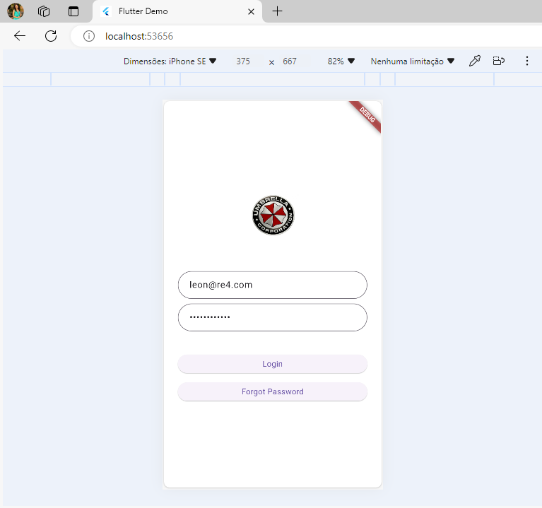
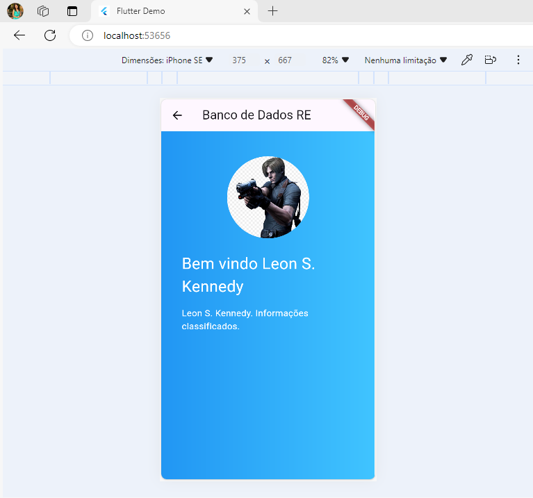

# desafio_login

Atividade de tutorial de um aplicativo de login construído com flutter.

Aqui está o repositório do meu site do aplicativo flutter: <a href="https://github.com/FrancislaineRod/atividade-tutorial-flutter-desafioLogin">Aplicativo login</a>

Segue o arquivo do tutorial: <a href="https://github.com/FrancislaineRod/atividade-tutorial-flutter-desafioLogin/blob/main/Exerccio01TutorialFlutter_20240516172952.pdf">Aplicativo login</a>

## Getting Started

This project is a starting point for a Flutter application.

A few resources to get you started if this is your first Flutter project:

- [Lab: Write your first Flutter app](https://docs.flutter.dev/get-started/codelab)
- [Cookbook: Useful Flutter samples](https://docs.flutter.dev/cookbook)

For help getting started with Flutter development, view the
[online documentation](https://docs.flutter.dev/), which offers tutorials,
samples, guidance on mobile development, and a full API reference.
